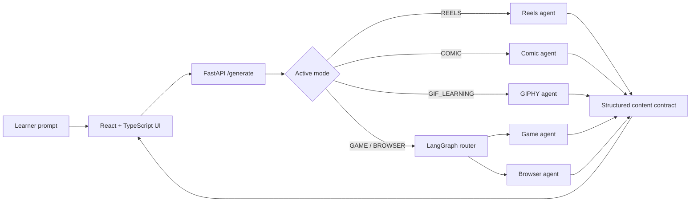

# The way Gen_Z learn's

The way Gen_Z learn's turns a learning prompt into an interactive lesson instead of a long static answer. Learners choose a mode from the sidebar, enter a topic, and receive a focused experience built from safe, structured data and React templates.

## Builder experience: Codex and GPT-5.6

This project started from a personal concern about cognitive offloading: when learning is reduced to passive answers, it is easy to consume information without retaining or thinking through it. The goal was to let learners explore a topic in the medium they already enjoy—Reels, games, comics, GIFs, or guided browser experiences—so that learning feels more active and memorable.

Before this hackathon, the project had an earlier prototype with a comic feature and a broken image-humour feature. I had experimented with several AI tools and prompting styles, including examples and few-shot prompts, but often received incomplete functionality or generic interfaces that did not match the product I had in mind.

The Devpost hackathon credits gave me access to Codex with GPT-5.6 Terra. I used them to inspect and migrate the existing codebase, replace broken paths, and build the current experience end to end. The work included the Reels lesson flow and its 30 visual templates, comics, GIF Learning, the macOS-inspired Browser Lab, and the eight game templates.

Codex and GPT-5.6 were especially useful for turning screenshots and short correction requests into targeted frontend and backend changes. They helped identify the relevant implementation area, preserve working features while making changes, create reusable templates, validate generated content, and resolve edge cases such as incomplete game data, repeated Reel content, narration behaviour, and topic-specific GIF selection. In my experience, this made it much easier to move from an idea in my head to a more polished, production-style implementation.

I also used Codex’s advanced reasoning settings, from Light and Medium through High and Extra High. In my personal experience, High and especially Extra High gave the strongest results for larger migrations, complex UI corrections, reusable template creation, and edge-case fixes. GPT-5.6 was able to understand the existing implementation, compare it with my latest request, spot where a correction belonged, and make the change without losing the rest of the product flow. This is my experience using the tool during the project, not a formal benchmark.

### What I built and achieved

During this project, I moved the product from a limited and partly broken prototype to a multi-mode interactive learning platform.

- I replaced the old, inconsistent interface with a clearer colourful learning workspace: readable text, centred lesson experiences, responsive layouts, and focused mode selection.
- I built **Reels**, an LLM-sized 10–30 step learning flow with structured progression, unique narration per step, random Microsoft Natural voices, 30 visual CSS templates, and a varied set of animation treatments.
- I improved the **Gaming** experience with a popup mode picker, Auto pick, eight different learning games, individual colour themes, completion screens, and stronger game prompts.
- I added game reliability checks on both backend and frontend. Generated games are validated, retried when invalid, given a safe fallback when needed, and normalized before they reach the game component.
- I rebuilt **Comics** as a selectable, original-character experience with 24 colourful templates, local CSS canvases, multiple pages, narration, and structured panel generation.
- I created the **Browser Lab** as a safe, macOS-inspired guided simulation with interactive fields, a dock, app previews, and genie-style minimize behaviour.
- I replaced the old broken image-humour feature with **GIF Learning**. Alex, the default guide, explains the concept as one continuous story and connects every topic-specific GIPHY visual cue to the explanation before and after it.
- I made GIF retrieval dynamic rather than static: the backend searches the learner’s topic and relevant keywords, avoids generic trending fallbacks, and verifies that unrelated topics return different visual result sets.
- I added safer generation boundaries and fallbacks so incomplete AI output does not break a lesson. Reels, games, comics, browser lessons, and GIF Learning all use structured content contracts instead of AI-generated UI code.
- I documented the product, current features, architecture, reliability approach, API flow, and extension paths so the project can be maintained and expanded after the hackathon.

The current product has five learning modes:

| Mode | Best for | What the learner receives |
| --- | --- | --- |
| **Reels** | A guided overview of a topic | A vertical, short-form lesson with 10–30 purposeful narrated cards. |
| **Gaming** | Recall, classification, order, and relationships | One of eight playable micro-games with feedback and level completion. |
| **Comics** | Stories, metaphors, and high-level flows | A selectable comic universe with paginated, narrated panels. |
| **Browser** | Configuration and click-through procedures | A macOS-inspired browser lab with a guided form workflow and animated dock. |
| **GIF Learning** | Visual memory cues for a topic | A guided story where Alex explains the topic and inserts relevant GIPHY GIFs as visual cues. |

## Product flow

1. Select a learning mode in the sidebar.
2. Start a new session and enter a concise topic, such as `How binary search works`.
3. The way Gen_Z learn's sends the topic, active mode, and (when applicable) selected game template to `POST /generate`.
4. The backend generates and validates a structured response.
5. The frontend selects a fixed renderer for that response. The model provides lesson data, never arbitrary CSS, JavaScript, or React markup.
6. Sessions are stored locally in the browser so learners can return to earlier lessons in the same browser.

## Reels

Reels is a focused, phone-sized vertical feed in the middle of the lesson canvas—not a full-screen black panel. It is designed to teach one connected idea at a time.

### LLM-sized 10–30 Reel lesson structure

The LLM chooses the number of ordered steps the explanation needs—from **10 to 30**. A quick explanation commonly uses around 10–12, and detailed subjects can use up to 30. The maximum-depth outline below is used only when all 30 steps add new learning value:

| Steps | Purpose |
| --- | --- |
| 1–5 | Motivation, context, and foundations |
| 6–20 | Core mechanics in a logical sequence |
| 21–26 | Edge cases, trade-offs, and practical use |
| 27–30 | Practice, recap, and a memorable conclusion |

Each step contains a `title`, `hook`, `body`, `takeaway`, and `voiceover`. The Reels agent checks that the LLM-selected count stays within 10–30, numbering is contiguous, required text exists, and titles and narration are not duplicated. If the AI response is incomplete or malformed, it returns a safe 10-Reel fallback lesson instead of a broken feed.

### Templates and animation system

There are **30 CSS card templates**. Their order is shuffled per lesson so a topic does not always look the same. Each template has a distinct colour, pattern, ornament, or composition, and is paired with a text-motion treatment.

The current animation pool includes:

- Typewriter reveal
- Word-by-word blur-in
- Masked slide reveal
- Pop-up words
- Cinematic fade
- Ticker and terminal-slide movement
- Number counter
- Anagram-style spacing transition
- Letter burst
- Underline reveal
- Scramble/glitch reveal
- Jello wobble
- Shimmer text
- Hand-drawn annotation
- Liquid text and ambient orb movement

Effects replay when a Reel becomes active. `prefers-reduced-motion` disables the motion while keeping all lesson text visible.

### Narration

Reels uses the browser's Speech Synthesis API. There is no voice dropdown in Reels. A different installed Microsoft Natural voice is randomly assigned to each Reel from the approved names:

- Ava, Andrew, Emma, Brian, Jenny, Guy, Aria
- Leah, Luke
- William Multilingual, Natasha, William

The narrator’s short name is displayed on the Reel and in the player header. If one of those voices is not installed or available in the browser, the Reel remains usable and advances without substituting an unapproved voice.

## Gaming

The Gaming mode starts with an **Auto pick** option and a popup picker for these eight templates:

| Template | Learning interaction |
| --- | --- |
| `CATCH_DROP` | Catch correct facts while avoiding believable decoys. |
| `WORD_DECODE` | Infer a term from concise clues. |
| `MAZE_ESCAPE` | Select safe decisions and learn why routes are correct or wrong. |
| `MEMORY_FLIP` | Match terms with definitions. |
| `SEQUENCE_SORT` | Put a process into its correct order. |
| `BINARY_JUMP` | Answer unambiguous True/False statements. |
| `SPACE_SHOOTER` | Clear ordered learning targets. |
| `CIRCUIT_CONNECT` | Link related concepts through correct relationships. |

### Game quality safeguards

Game generation is deliberately template-aware. The backend validates every generated level before it is shown:

- Selected templates are honoured; Auto pick selects a fitting one.
- Level counts, label lengths, time limits, and score targets are bounded.
- Sequence games require contiguous unique orders.
- Matching games require unique pairs.
- True/False, path, and classification games require valid correct and incorrect choices.
- Circuit links cannot be self-links or duplicates.
- Invalid AI output receives one repair attempt, then a safe playable fallback is used.

The frontend normalizes and de-duplicates game data again before rendering. This second boundary protects each game component from malformed API responses, missing fields, repeated labels, out-of-range timers, and edge cases in old saved sessions.

## Comics, Browser, and GIF Learning

### Comics

Comics uses only original learning characters and settings. Learners can choose Byte Hero, Pixel Bot, Nova Alien, Fox Genius, Professor Panda, Wise Owl, Captain Cloud, Code Dragon, HeroVerse, Super Squad, Fairy Tales, Cat vs Mouse, Alien Morph, Mystery Town, Stunt Rider, Cyber Runner, Superhero Universe, Fantasy Kingdom, Robot Academy, Alien Adventures, Mystery Detectives, Pirate Legends, Space Explorers, or Ninja Academy. Each template has a small named cast—for example Alien Aster, Alien Azure, Alien Vartek, Rocket Bloom, Rocket Hunk, Detective Iris, Detective Miles, Dragon Vela, and Dragon Kairo. The backend rotates the cast over a page and sends each character's display name and gender metadata to the renderer, so female and male characters use the corresponding speech voice. Panel dialogue is injected into fixed, colourful local CSS canvases; the app never retrieves old or third-party templates.

### Browser Lab

Browser lessons are safe, simulated configuration walkthroughs. The renderer presents generated screens and fields inside a macOS-style workspace with Safari, a dock, supporting app previews, and a genie-style minimize animation. It validates the relevant select/radio choices in the browser; it does not operate a real cloud account or submit information to an external service.

### GIF Learning

GIF Learning is one connected explanation led by the default guide, Alex. The backend searches GIPHY Sticker Search with the learner’s topic and its meaningful keywords, then the lesson generator places each cue between Alex's introduction and follow-up explanation. Generic trending content is never used as a fallback, so the visual cues remain topic-specific. The UI shows a vertical story, not a GIF gallery: no GIF counter, creator metadata, or separate card grid is shown. A valid `GIPHY_API_KEY` is required in `backend/.env`.

## Architecture



### Backend

- **FastAPI** exposes generation and comic continuation endpoints.
- **LangGraph** routes Game and Browser requests to their specialized agents. Reels, Comics, and GIF Learning have direct mode-specific paths so their contracts stay clear.
- **LangChain Groq** supplies the LLM through `app/config.py`.
- Startup preloads the local comic canvas store. GIFs are fetched only when GIF Learning is requested.
- When `frontend/dist` exists, FastAPI serves the production React build and its assets from the same application.

### Frontend

- **React + TypeScript + Vite** provides the application shell and typed experience contracts.
- **Framer Motion** powers card, dialog, dock, and game transitions.
- **CSS templates** provide the visual variation; the model never returns executable UI code.
- **Local storage** persists sessions under `kf_sessions` on the current browser only.

## Reliability, scalability, and maintainability

### Reliable generation boundaries

The most important reliability rule is separation of content from rendering. Agents return JSON data and renderers own the UI. A malformed title cannot become arbitrary HTML or a broken stylesheet.

- Reels validates count, sequence, required fields, and uniqueness before use.
- Games validate their template-specific constraints, retry once, and fall back safely.
- Game renderers normalize data a second time at the client boundary.
- Comic generation sanitizes and partially parses structured JSON, then falls back to a simple panel when needed.
- Browser Lab is a client-side simulation, so it never executes shell commands or changes external cloud resources.

### Scalable composition

Each mode has an isolated backend agent and frontend renderer. This makes it possible to add one mode without rewriting the other modes. Data contracts live in `frontend/src/types/chat.ts`; supported game IDs are shared conceptually by the game agent, renderer, picker, and normalizer.

The approach scales vertically as well: a lesson can add more Reel templates, comic universes, game templates, or browser field types without allowing AI output to control application code.

### Maintainable extension points

To add a new **Reel visual template**:

1. Add or update its CSS selector in `frontend/src/index.css`.
2. Keep the `TEMPLATE_IDS` count aligned with the number of templates.
3. Add a reusable entry to `TEXT_EFFECTS` only when a new motion pattern is needed.
4. Preserve the reduced-motion rule.

To add a new **game template**:

1. Add its ID to `GameTemplate` in `frontend/src/types/chat.ts`.
2. Add it to `GAME_TEMPLATES`, the generation prompt, validation logic, and fallback data in `backend/app/agents/game_agent.py`.
3. Add normalization in `frontend/src/components/renderers/games/gameData.ts`.
4. Add the interactive component and route it from `GameRenderer.tsx`.
5. Add it to the picker in `App.tsx` and provide a visually distinct theme in `index.css`.

This checklist keeps the backend contract, defensive validation, and visual renderer in sync.

## API contracts

### `POST /generate`

Request:

```json
{
  "concept": "How binary search works",
  "active_folder": "REELS",
  "medium": "REELS",
  "template": null
}
```

Response fields:

```json
{
  "medium": "REELS",
  "template": "REELS_FEED",
  "title": "Binary Search: 12-step Reel Guide",
  "description": "A 12-step vertical Reel lesson about binary search.",
  "content": {}
}
```

Additional endpoints:

- `POST /generate-comic-page` — creates the next page in a selected comic universe.
- `GET /comic-clusters` — returns available comic cluster metadata.

## Run locally

### Prerequisites

- Python 3.10+
- Node.js 20+
- A Groq API key

Create `backend/.env`:

```env
GROQ_API_KEY=your_groq_api_key
GIPHY_API_KEY=your_giphy_api_key
```

Start the backend:

```bash
cd backend
python -m venv .venv
.venv\Scripts\activate
pip install -r requirements.txt
uvicorn main:app --reload --port 8000
```

For frontend development in a second terminal:

```bash
cd frontend
npm install
npm run dev
```

For a single-server production-style run, build the frontend first, then start FastAPI:

```bash
cd frontend
npm run build

cd ../backend
uvicorn main:app --port 8000
```

Open `http://localhost:8000` after the production build, or use the Vite URL during frontend development.

## One-container Docker and Cloud Run deployment

The root `Dockerfile` is a two-stage build: it compiles `frontend/`, copies the built files beside `backend/`, and starts FastAPI as the only HTTP server. This is the production layout used by Cloud Run, so the browser calls the API on the same origin and no separate frontend host or CORS configuration is needed.

Build and run the same image locally:

```bash
docker build -t the-way-gen-z-learns .
docker run --rm -p 8080:8080 --env-file backend/.env the-way-gen-z-learns
```

Open `http://localhost:8080`. The Docker build intentionally excludes `.env` files; do not use Docker build arguments for API keys.

To deploy this single container from the repository root, first enable the required Google Cloud APIs and create Secret Manager secrets named `groq-api-key` and `giphy-api-key`. Grant the Cloud Run service identity the **Secret Manager Secret Accessor** role for those secrets. Then deploy:

```bash
gcloud services enable run.googleapis.com cloudbuild.googleapis.com artifactregistry.googleapis.com secretmanager.googleapis.com

gcloud run deploy the-way-gen-z-learns \
  --source . \
  --region us-central1 \
  --allow-unauthenticated \
  --set-secrets=GROQ_API_KEY=groq-api-key:1,GIPHY_API_KEY=giphy-api-key:1
```

Cloud Build uses the root `Dockerfile`, and Cloud Run supplies the `PORT` environment variable. The container listens on `0.0.0.0:$PORT` (default `8080` locally), serves both the React UI and FastAPI API, and keeps runtime secrets outside the image.

## Verification commands

```bash
cd frontend
npm run build
npm run lint

cd ../backend
python -m py_compile main.py app/agents/reels_agent.py app/agents/game_agent.py
```

## Repository layout

```text
backend/
  main.py                         FastAPI endpoints and static hosting
  app/agents/                     One generator per learning mode
  app/graph/                      LangGraph routing workflow and state
  app/db/                         Local comic canvas data store
frontend/
  src/components/renderers/       Mode renderers and individual game components
  src/components/layout/          Sidebar and shell components
  src/types/chat.ts               Shared UI data contracts
  src/index.css                   Global themes, game styles, and Reel templates
```
