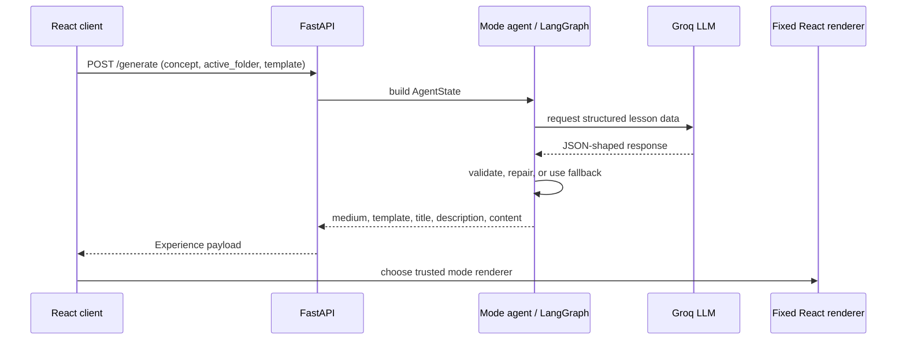

# The way Gen_Z learn's — backend architecture

This document describes the backend as it is implemented today. Its job is to turn a topic into a safe, renderer-ready learning experience—not to generate browser code or execute user commands.

## Request lifecycle



`backend/main.py` receives a `GenerateRequest` with four useful fields:

| Field | Meaning |
| --- | --- |
| `concept` | The topic to teach. |
| `active_folder` | The selected sidebar mode. |
| `medium` | A compatibility copy of the selected mode. |
| `template` | A user-selected template, currently used for game selection. |

The response always uses the same high-level shape:

```json
{
  "medium": "GAME | COMIC | BROWSER | GIF_LEARNING | REELS",
  "template": "renderer-specific identifier",
  "title": "lesson title",
  "description": "short lesson description",
  "content": {}
}
```

The TypeScript representation is maintained in `frontend/src/types/chat.ts`.

## Routing

`generate_experience` uses explicit routing when a learner has already selected a mode:

| Selected mode | Backend path |
| --- | --- |
| `REELS` | `app.agents.reels_agent.generate_reels` |
| `COMIC` | `app.agents.comic_agent.generate_comic` |
| `GIF_LEARNING` | `app.agents.giphy_agent.generate_giphy_learning` |
| `GAME` / `BROWSER` | LangGraph workflow |

The LangGraph workflow has three nodes: `route_experience`, `GAME`, and `BROWSER` (with `COMIC` available as a routed fallback). The orchestration agent selects the most appropriate graph node when a mode is not explicitly pinned.

## Mode agents

### Reels agent

`app/agents/reels_agent.py` owns the Reels contract.

- Generates exactly 30 sequential lessons.
- Requires `step`, `title`, `hook`, `body`, `takeaway`, and `voiceover` on every Reel.
- Enforces step numbers 1–30 with no gaps.
- Limits field lengths so text fits compact visual cards.
- Rejects duplicate titles and duplicate narration.
- Falls back to an ordered 30-step lesson if generation or JSON parsing fails.

The React Reels renderer owns all visual variation: 30 CSS templates, randomized order, active-card animation effects, browser narration, and scroll navigation. The agent never produces CSS or animation names.

### Game agent

`app/agents/game_agent.py` supports:

```text
CATCH_DROP, WORD_DECODE, MAZE_ESCAPE, MEMORY_FLIP,
SEQUENCE_SORT, BINARY_JUMP, SPACE_SHOOTER, CIRCUIT_CONNECT
```

The agent validates both common and template-specific gameplay constraints. Examples include contiguous sequence orders, unique memory terms, explicit boolean values, correct and decoy paths, and unique circuit links. Invalid LLM output receives a corrective retry. If that fails, a playable template-specific fallback is returned.

The frontend repeats defensive normalization in `games/gameData.ts`. This defense-in-depth design is intentional: the server guards newly generated data, while the client also protects old saved sessions and malformed network payloads.

### Comic agent

`app/agents/comic_agent.py` requests a concise panel screenplay using an approved original-character roster, background, and pose. Every roster has named female and male characters, and the assembler rotates cast members over a page, attaches display-name and gender metadata, sanitizes/parses the response, normalizes template choices to the approved set, and injects escaped text into a fixed local CSS canvas. It does not query remote or legacy comic canvases, so an old template cannot reappear. The renderer bundles the shared original-comics CSS, shows the selected character name, uses gender metadata for speech-voice selection, and may request up to four pages through `/generate-comic-page`.

### Browser agent

`app/agents/browser_agent.py` produces a browser walkthrough schema: screens, fields, acceptable choices, and next-button labels. The client renders it as a simulated macOS-style workspace. This is a learning environment only; the backend does not automate a real browser, execute commands, or modify a cloud service.

### GIPHY agent

`app/agents/giphy_agent.py` searches the first GIPHY Sticker Search page with the learner's original topic plus meaningful topic keywords and a family-friendly rating. It randomly selects from those topic results and never uses generic trending content as a fallback. It then asks the LLM for a guide-led sequence of text and GIF references. Validation requires Alex to introduce and explain every visual cue, uses every selected GIF once, and prevents duplicate or unknown references. The React renderer owns the narrator, progressive story display, and the visual treatment.

## Reliability model

### 1. Content is data; UI is code

Agents return fields that an existing renderer understands. They do not return React components, CSS, scripts, or executable terminal commands. This protects the visual system from prompt output and makes rendering predictable.

### 2. Validate before render

The strongest validation is implemented where data is most specialized:

| Content | Server checks | Client checks |
| --- | --- | --- |
| Reels | Exact count, order, required text, uniqueness | Typed display and safe empty state |
| Games | Playability rules per template, retry, fallback | De-duplication, clamps, type checks, item bounds |
| Comics | JSON cleanup, approved-template normalization, local canvas fallback | Safe panel/page handling |
| Browser | Renderer-ready screen shape | Form state and required choice feedback |

### 3. Fallbacks keep lessons usable

If an LLM request, JSON parse, or specialized validation fails, the mode returns a minimal structured lesson instead of propagating a backend exception to the learner. Fallbacks are deliberately template-compatible so they pass through the same renderer path as normal responses.

### 4. Bounded output controls performance

Field length limits, fixed Reel count, bounded game level and item counts, and fixed comic page limits prevent oversized responses from creating slow or unusable screens. FastAPI handlers and LangChain Groq calls are asynchronous so independent requests do not block the ASGI event loop during network waiting.

## Data stores and startup

At FastAPI startup, `main.py` loads the local comic canvas collection into memory. GIPHY content is fetched only when a GIF Learning request is made. The application can serve a built frontend from `frontend/dist` using Starlette `StaticFiles`, which supports a single-service local or container deployment.

## Container deployment

The root `Dockerfile` builds the React app in a Node stage, copies `frontend/dist` beside the Python backend, and runs one Uvicorn/FastAPI ingress container. `main.py` serves both the static UI and API from that process. The command binds to `0.0.0.0:$PORT`, which is compatible with Cloud Run. `.dockerignore` excludes local environments, build output, and `.env` files; runtime keys are supplied through Cloud Run Secret Manager instead of being baked into the image.

## Extending safely

When adding a new template or mode, update the complete contract rather than only the prompt.

### New game template

1. Add the identifier to the TypeScript union and backend template set.
2. Define generator instructions, validation rules, and a safe fallback.
3. Normalize the returned data in `gameData.ts`.
4. Add a renderer and connect it in `GameRenderer.tsx`.
5. Add the selector UI and visual theme.

### New Reel template or motion style

1. Add a CSS template selector in `frontend/src/index.css`.
2. Keep `TEMPLATE_IDS` synchronized with the visual template count.
3. Add a reusable effect to `TEXT_EFFECTS` only when needed.
4. Keep the active-card trigger and `prefers-reduced-motion` behavior intact.

### New learning mode

1. Add a sidebar mode ID and an `Experience.medium` union member.
2. Define a backend agent that returns a stable content shape.
3. Route it in `generate_experience` or the LangGraph workflow.
4. Build a dedicated renderer and register it in `App.tsx`.
5. Add validation and a safe fallback before considering the mode complete.

## Operational notes

- Required environment variable: `GROQ_API_KEY`. GIF Learning also requires `GIPHY_API_KEY`.
- `POST /generate` is the primary generation endpoint.
- `POST /generate-comic-page` continues an existing comic story.
- `GET /comic-clusters` returns the available universe metadata.
- During frontend development, Vite talks to FastAPI on port 8000. In production-style use, build the frontend and FastAPI serves `frontend/dist` itself.
